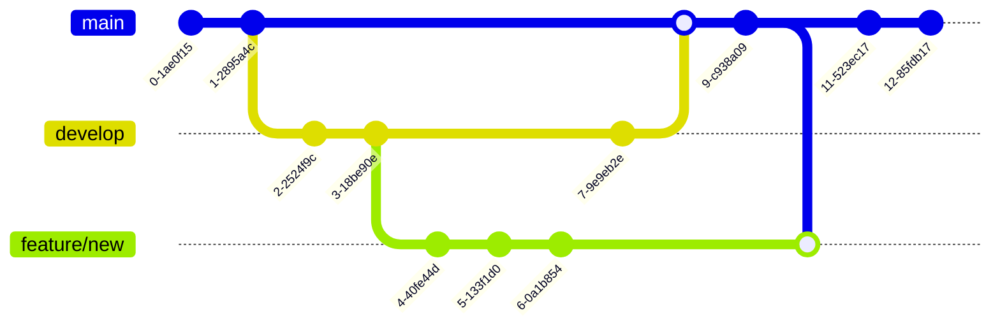
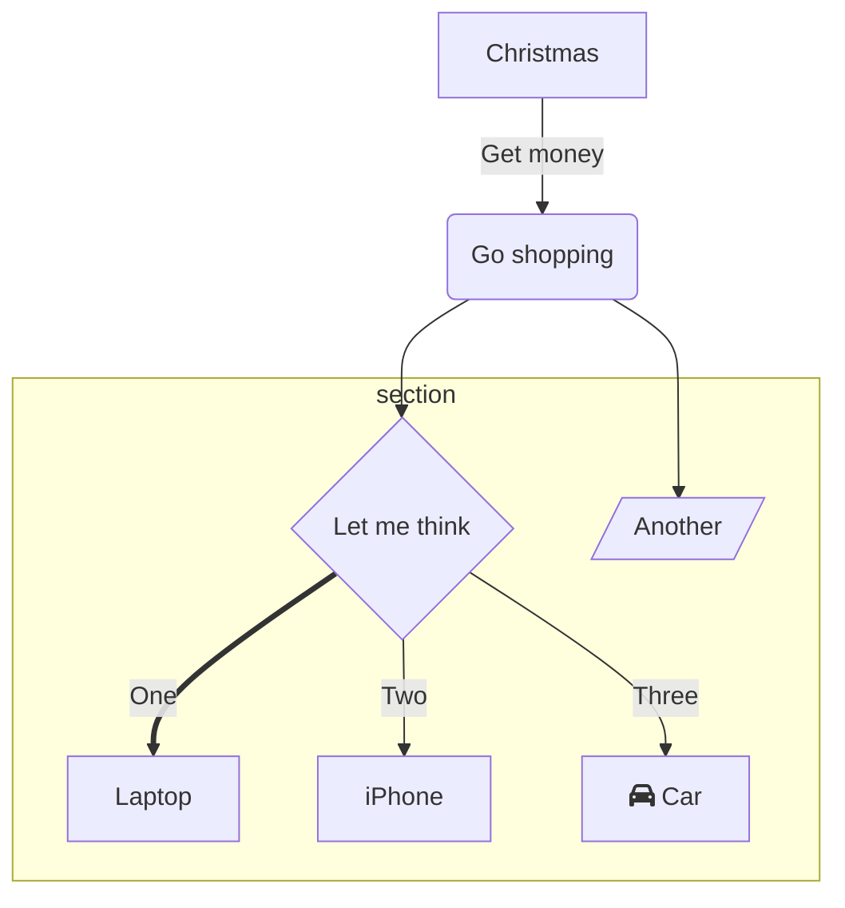

# Great Graph, Awesome

```mermaid
gitGraph
    commit
    commit
    branch develop
    checkout develop
    commit
    commit
    branch feature/new
    commit
    commit
    commit
    checkout develop
    commit
    checkout main
    merge develop
    commit
    checkout feature/new
    merge main
    checkout main
    commit
    commit
```

```mermaid
        graph TD
          A[Christmas] -->|Get money| B(Go shopping)
          B --> C{Let me think}
          B --> G[/Another/]
          C ==>|One| D[Laptop]
          C -->|Two| E[iPhone]
          C -->|Three| F[fa:fa-car Car]
          subgraph section
            C
            D
            E
            F
            G
          end
```